# KOVA 2 implementation report

**Date:** 2026-07-21  
**Product:** KOVA — Video Localization Studio  
**Scope:** source implementation and non-GPU/non-UI verification only

## Outcome

KOVA now has a Vietnamese/English Wails + React desktop shell, an explicit
five-stage review-first timeline, and a separate **KOVA Voice Studio** product
for consented, fixed voice profiles. The desktop workflow calls one existing
worker operation at a time; it never silently downloads, translates, dubs,
renders, or publishes a later step.

The old, unrelated product branding and Colab notebook references in the
current UI/documentation path were replaced with KOVA terminology. The retired
legacy notebook is now intentionally non-runnable and points to the current
KOVA Voice Studio notebook, avoiding the previously observed incompatible
`HiggsAudioV2TokenizerModel` startup path.

## Canonical user flow

```mermaid
flowchart LR
  A[01 Source: Start] --> AR[Review source / subtitle]
  AR -->|Approve| B[02 Translation: Start]
  B --> BR[Edit and review Vietnamese SRT]
  BR -->|Approve| C[03 Fixed voice: Start]
  C --> CR[Review audio + timing]
  CR -->|Approve| D[04 Video output: Start]
  D --> DR[Review preview]
  DR -->|Approve| E[05 Outputs: Start]
  E --> ER[Review final artifacts]
```

| KOVA stage | Desktop operation | Existing worker endpoint | What the user must check |
|---|---|---|---|
| 01 · Video source | `Start this stage` | `POST /api/v1/jobs/subtitle/stages/source` | Source URL/input and source subtitle artifact |
| 02 · Translation and subtitles | `Start this stage` | `POST /api/v1/jobs/subtitle/{task}/translation` | Edit/save/approve target SRT or script |
| 03 · Fixed dubbing voice | `Start this stage` | `POST /api/v1/jobs/subtitle/{task}/dubbing/audio` | One selected profile/preset, audio and cue timing |
| 04 · Video output and tuning | `Start this stage` | `POST /api/v1/jobs/subtitle/{task}/dubbing/video` | Preview video, subtitles, and audio alignment |
| 05 · Outputs | `Start this stage` | `POST /api/v1/jobs/subtitle/{task}/render` | Final MP4/SRT/audio artifacts |

`Refresh outputs` is read-only: it reads the workflow state and changes the
matching KOVA run to **Needs review**. `Approve output` advances exactly one
matching worker review gate. Re-running an earlier stage marks downstream
runs stale. The source URL is saved as an immutable draft before its worker job
is started, so a local persistence failure cannot create an unrecorded remote
job.

## Desktop UI implementation

Primary source:

- `wails_main.go` starts the KOVA desktop host.
- `app.go` exposes typed Wails bindings; it does not expose API keys, cookies,
  reference audio paths, or worker tokens to project storage.
- `frontend/src/App.tsx` contains the three-column desktop layout, five left
  workflow tabs, explicit actions, project selector, review editor, artifact
  inspector, and TTS dropdown.
- `frontend/src/i18n.ts` is the Vietnamese/English UI dictionary.
- `internal/project/` persists the review timeline in SQLite, independently of
  the compatibility v1 job persistence.

The static browser page remains a diagnostic compatibility surface. It is not
the replacement for KOVA Desktop.

## Voice Studio: independent product and KOVA integration

Source: `voice-studio/`.

- The FastAPI service owns its own profile database and reference files.
- `voice-studio/static/` is a self-contained bilingual profile-library UI at
  `/`. It creates consented profiles and lists ready profiles. The token stays
  in the current browser page memory only.
- Profile creation accepts WAV, MP3, or FLAC reference audio between 3 and 30
  seconds, decodes it before persistence, requires consent, records a SHA-256
  and an immutable profile version, and never returns the worker-side path.
- KOVA lists only `{id, name, language, status}` from `/v1/voices`.
- The dubbing client now recognizes `profile:<id>` and calls `/generate`
  directly. It does not upload a new reference file for every subtitle cue.
  Therefore the selected profile stays fixed for the complete job.

The Voice Studio dropdown provides these deliberate choices:

| Dropdown value | Use |
|---|---|
| KOVA Voice Studio (OmniVoice) | Fixed voice clone; requires worker, temporary token, and one ready profile |
| Google TTS Vietnamese | Gateway preset; not a clone |
| Google TTS English | Gateway preset; not a clone |
| Microsoft Edge TTS Vietnamese Hoài My | Gateway preset; not a clone |
| Microsoft Edge TTS Vietnamese Nam Minh | Gateway preset; not a clone |

## Translation and timing fixes

- The subtitle optimizer has a target-language-aware prompt. For Vietnamese it
  requires ordinary English to be translated while permitting proper names.
- The existing target-language quality gate rejects residual untranslated
  English rather than treating it as a successful translation.
- Dubbing speed policy is now: `0.95x` minimum, `1.08x` review threshold,
  `1.12x` hard limit. A cue above the review threshold is surfaced for the
  user; a cue above the hard limit is not silently accepted. This prioritizes
  complete words and the original cue timeline over hidden truncation.

These settings do not claim that a particular video is already perfectly
translated or synchronized: they make each problem observable and block the
next step until the user checks it.

## Colab worker and prior startup error

Current notebook:
`voice-studio/notebooks/Kova_Voice_Studio_GPU.ipynb`.

1. The KOVA button opens the notebook URL only after a user click.
2. The user selects a **GPU** Colab runtime and chooses **Run all**.
3. The notebook clones KOVA and the official `k2-fsa/OmniVoice` source into an
   isolated Python 3.11 environment.
4. Before serving it checks `nvidia-smi`, CUDA availability,
   `HiggsAudioV2TokenizerModel`, the pinned Transformers version, and the
   OmniVoice import.
5. It sets `KOVA_VOICE_REQUIRE_CUDA=1`, rejects CPU fallback, starts the
   service, creates a random bearer token, and prints
   `KOVA_VOICE_URL`, `KOVA_VOICE_TOKEN`, and `DEVICE=cuda`.
6. The user pastes only the current URL and token into KOVA Voice Studio or the
   fixed-voice stage, checks the connection, loads profiles, then selects one.

The former `notebooks/Kova_OmniVoice_Colab.ipynb` is retained only as a small
non-runnable redirect. It cannot accidentally start the incompatible legacy
OmniVoice Studio stack.

## Requirements for a complete user-run job

| Need | Required when | Where it goes | Notes |
|---|---|---|---|
| Windows desktop dependencies: `ffmpeg`, `ffprobe`, `yt-dlp` | Processing public URL/video and renders | `PATH` or KOVA `bin` | Required by the current local worker pipeline |
| Source video URL or local media | Always | Stage 01 | Use content you are allowed to process |
| YouTube cookies in Netscape `cookies.txt` form | Only if YouTube restricts download/subtitles for the user account | KOVA's configured cookie path | Not needed for a normally accessible public video; never commit it |
| Transcription provider | When source subtitles are not already supplied | KOVA transcription configuration | Choose a supported online API credential or provision the selected local transcription runtime/model; no local GPU is mandatory for the Colab voice path |
| `KOVA_API_GATEWAY_API_KEY` | KOVA Gateway translation and Google/Edge preset TTS | Process environment or ignored `config/config.toml`; never commit it | Default free translator is `oc/deepseek-v4-flash-free`; KOVA does not install Ollama or a local LLM |
| KOVA Gateway URL | Gateway translation and preset TTS | Built-in default `http://3.27.172.90/v1` | The supplied gateway is HTTP. Use only on a trusted network; switch to HTTPS when the gateway provides it. The translation UI accepts only the six verified free model IDs. |
| Google account + Colab GPU | OmniVoice fixed voice | User's Colab session | The notebook is user-started and the tunnel URL is temporary |
| Worker URL + worker token | OmniVoice fixed voice | Runtime connection fields only | HTTPS required except localhost for development; token is not serialized to TOML/project files |
| 3–30 second authorized reference audio + consent | Create a cloned profile | KOVA Voice Studio | Reference stays in Voice Studio; choose exactly one profile for a video |
| GitHub repository at the notebook's configured URL | Colab notebook clone | Notebook `REPO_URL` | The configured `khoinguyen59/kova-video-dubbing` remote must exist and contain this revision before the notebook can clone it |

## Verification performed

No desktop/browser UI was opened, no video was downloaded, and no GPU/Colab
work was started. The gateway checks below were deliberately short contract
checks before integration; no user media or generated audio was saved.

| Command/check | Result |
|---|---|
| `go test . ./internal/project ./internal/router ./pkg/omnivoice ./internal/service/dubbing ./internal/service` | Passed |
| `npm run build` in `frontend/` | Passed (TypeScript + Vite production build) |
| `PYTHONPATH=src python -m pytest -q tests` in `voice-studio/` | Passed: 4 tests; one upstream Starlette `TestClient` deprecation warning |
| Notebook JSON contract check | Passed; verified CUDA guard, URL/token outputs, tokenizer check, and valid nbformat |
| `GET /v1/models` on the supplied gateway | HTTP 200; all six requested free translation model IDs were present |
| Streaming `POST /v1/chat/completions` with `oc/deepseek-v4-flash-free` | HTTP 200 SSE response; compatible with KOVA's streaming chat client |
| `POST /v1/audio/speech` with `google-tts/vi` | HTTP 200 `audio/mp3`; a short Vietnamese contract sample returned 26,112 bytes |

Notable automated coverage includes:

- five-stage prerequisite enforcement, including output blocked until render is
  reviewed and approved;
- immutable review draft creation;
- restricted Colab URL and HTTPS worker URL handling;
- gateway dropdown option presence;
- existing `profile:<id>` generation without reference upload;
- voice-consent, audio decoding, profile privacy, worker-token authentication,
  and Voice Studio independent UI serving.

## Remaining user acceptance test

The following must be performed by the user because it uses their accounts,
video rights, temporary Colab worker, API credits, and possible GPU allocation:

1. Build/run the desktop app and create a fresh project.
2. Start Stage 01 with a video you are authorized to process; refresh and
   inspect the source artifact.
3. Save/edit/approve Vietnamese subtitles. Confirm ordinary English is absent
   except real proper names.
4. Open the Colab notebook from KOVA, select GPU, run all, and confirm its
   output says `DEVICE=cuda`.
5. Create one consented profile in KOVA Voice Studio, then load/select it in
   KOVA Desktop.
6. Start dubbing, review each cue whose timing is flagged, and approve only
   when voice identity and pacing are acceptable.
7. Run preview/mux, inspect the preview, then run final outputs and verify
   MP4/audio/SRT artifacts.

## Deliberate boundaries

- No GitHub repository was created or pushed in this implementation pass: that
  requires the user's GitHub authorization. The notebook repository URL is a
  declared deployment prerequisite, not a claim that a remote was published.
- No proprietary executable was unpacked or copied. The supplied visuals were
  used only as layout/product references.
- Legacy Fyne components and broad provider compatibility code remain to avoid
  breaking existing jobs. The primary KOVA UI, current notebook, docs, and
  provider dropdown use KOVA naming and Vietnamese/English.
- A historical generated log under `test-runs/` may contain an old filesystem
  path. It is not loaded by the KOVA UI or current notebook and was left intact
  rather than deleting user/test artifacts.
